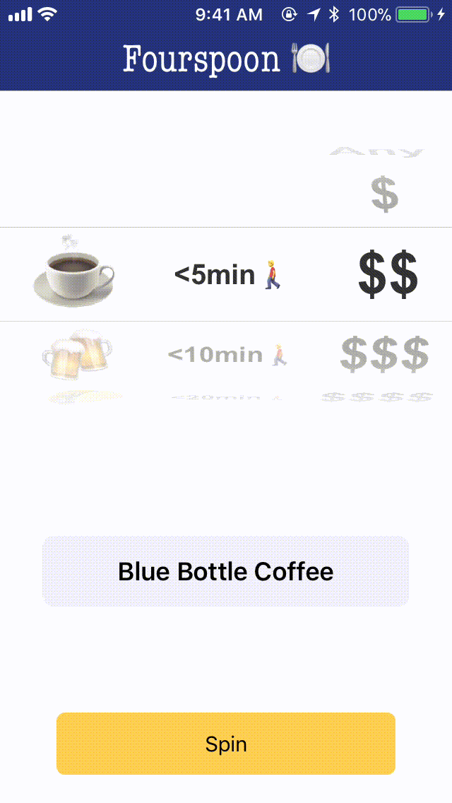

# Fourspoon
Urban Spoon throwback

# Getting Started
1. Clone or download the repo
2. Install the pods ~> `pod install`
3. Create a Foursquare API key at [developer.foursquare.com](https://foursquare.com/developers/apps)
4. Add your API key to FoursquareManager.swift ~> `let client = FoursquareAPIClient(clientId: "CLIENT_ID", clientSecret: "CLIENT_SECRET")`

